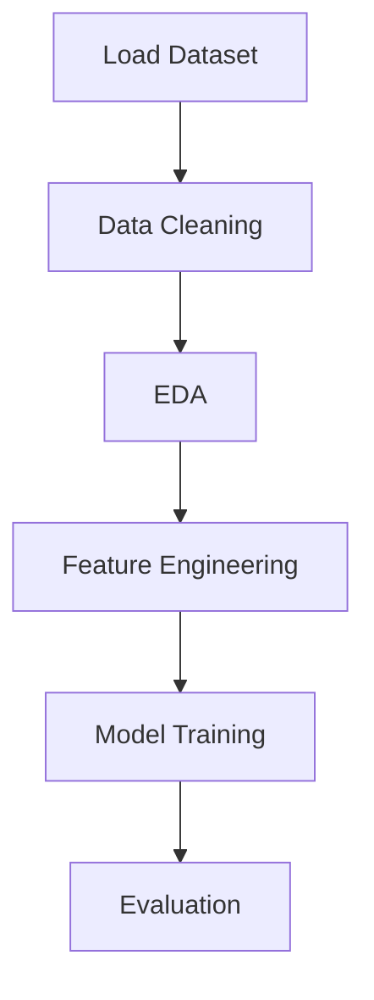

# 🌱 GrowSense – Smart Data Analysis & Machine Learning  

<p align="center">
  
  
  
  
</p>

---

## 📌 Overview  
GrowSense is a **data analysis and machine learning project** that focuses on extracting meaningful insights from structured datasets.  
It includes **EDA, preprocessing, feature engineering, and model building** to create accurate predictions.

---

## ✨ Key Highlights  
✔️ Clean and structured workflow  
✔️ Powerful data visualization  
✔️ Efficient preprocessing techniques  
✔️ Machine learning model implementation  
✔️ Beginner-friendly project  

---

## 🚀 Features  
🔍 Exploratory Data Analysis (EDA)  
🧹 Data Cleaning & Preprocessing  
🔤 Feature Encoding  
📊 Data Visualization  
🤖 Machine Learning Model Building  

---

## 🛠️ Tech Stack  

| Category        | Tools Used |
|----------------|----------|
| Language       | Python 🐍 |
| Libraries      | NumPy, Pandas |
| Visualization  | Matplotlib, Seaborn |
| ML Framework   | Scikit-learn |

---

## 📂 Project Structure  

```
GrowSense/
│── growsense.ipynb     # Main Notebook
│── README.md           # Documentation
│── data/               # Dataset (optional)
│── models/             # Saved models (optional)
```

---

## ⚙️ Installation & Setup  

### 1️⃣ Clone the Repository  
```bash
git clone https://github.com/your-username/growsense.git
cd growsense
```

### 2️⃣ Install Dependencies  
```bash
pip install -r requirements.txt
```

### 3️⃣ Run the Project  
```bash
jupyter notebook growsense.ipynb
```

---

## 📊 Workflow  



---

## 📸 Preview  

<p align="center">
  
</p>

---

## 🎯 Future Improvements  
🚀 Add advanced ML models  
📈 Hyperparameter tuning  
🌐 Deploy as a web app  
⚡ Real-time data integration  

---

## 🤝 Contributing  
Contributions are always welcome!  

1. Fork the repo  
2. Create your branch  
3. Commit changes  
4. Open a Pull Request  

---

## 📜 License  
This project is licensed under the **MIT License**  

---

## 👨‍💻 Author  

<p align="center">
  <b>Shubham Arya</b><br>
  💡 Passionate about Data Science & Machine Learning  
</p>

---

⭐ If you like this project, don't forget to **star the repo!**
