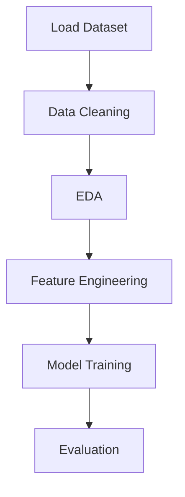
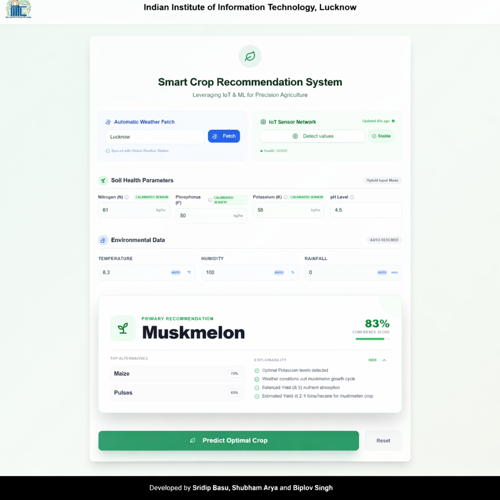

# 🌱 GrowSense – Smart Data Analysis & Machine Learning  

<p align="center">
  
  
  
  
</p>

---

## 📌 Overview  
GrowSense is a **data analysis and machine learning project** that focuses on extracting meaningful insights from structured datasets.  
It includes **EDA, preprocessing, feature engineering, and model building** to create accurate predictions.

---

## 🗄️ Dataset Note
This project uses a publicly available **Crop Recommendation dataset** commonly shared on Kaggle for educational and research purposes.
* The dataset includes soil nutrients, weather conditions, and crop labels.
* *Note: The dataset itself is not included in this repository.*

---

## ✨ Key Highlights  
✔️ Clean and structured workflow  
✔️ Powerful data visualization  
✔️ Efficient preprocessing techniques  
✔️ Machine learning model implementation  
✔️ Beginner-friendly project  

---

## 🚀 Features  
🔍 Exploratory Data Analysis (EDA)  
🧹 Data Cleaning & Preprocessing  
🔤 Feature Encoding  
📊 Data Visualization  
🤖 Machine Learning Model Building  

---

## 🛠️ Tech Stack  

| Category        | Tools Used |
|----------------|----------|
| Language       | Python 🐍 |
| Libraries      | NumPy, Pandas |
| Visualization  | Matplotlib, Seaborn |
| ML Framework   | Scikit-learn |

---

## 📂 Project Structure  

```text
GrowSense/
│── images/             # Visual assets and plots
│── models/             # Saved machine learning models
│── notebook/           # Jupyter notebooks (contains growsense.ipynb)
│── README.md           # Project documentation
│── requirements.txt    # Project dependencies
```

---

## ⚙️ Installation & Setup  

### 1️⃣ Clone the Repository  
```bash
git clone [https://github.com/your-username/growsense.git](https://github.com/your-username/growsense.git)
cd growsense
```

### 2️⃣ Install Dependencies  
```bash
pip install -r requirements.txt
```

### 3️⃣ Run the Project  
```bash
jupyter notebook notebook/growsense.ipynb
```

---

## 📊 Workflow  



---

## 📸 Preview  

<p align="center">
  <a href="images/prediction.png">
    
  </a>
</p>

---

## 🎯 Future Improvements  
🚀 Add advanced ML models  
📈 Hyperparameter tuning  
🌐 Deploy as a web app  
⚡ Real-time data integration  

---

## 📜 License  
This project is licensed under the **MIT License** ---

## 👨‍💻 Authors  

<div align="center">
  <b>Sridip Basu</b> | <i>M.Sc. AI/ML</i><br>
  <b><a href="https://biplovsingh.dev">Biplov Singh</a></b> | <i>M.Sc. Data Science</i><br>
  <b>Shubham Arya</b> | <i>M.Sc. Data Science</i><br>
</div>

---

⭐ If you like this project, don't forget to **star the repo!**